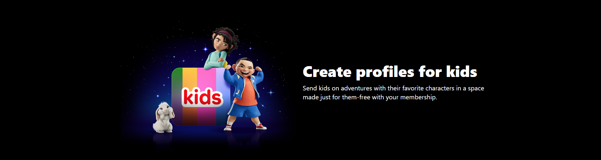

 
 

 

  Connect with Remi Olateru on <a href="https://www.linkedin.com/in/remi-olateru/">LinkedIn!</a>

## Project Overview

This project is a recreation of Netflix’s user interface, featuring MongoDB, Express.js, React, Node.js (MERN). It includes user authentication (Signup/Login), browse TV shows, Movies, actors/actresses through the search functionality, watch trailers, and view insights on video data.

## Features

- **User Authentication**
- **Browse Movies, TV Shows, Actors/Actresses**

- **Search Functionality**c
- **Responsive Design**

### Home Page

### Login Page

### Sign Up Page

*Each screenshot captures the layout, interactions, and UI components to showcase the overall design.*

## Technologies Used

- **Frontend**: [React, Tailwind CSS]
- **Backend**: [Node.Js]
- **Database**: [MongoDB]

