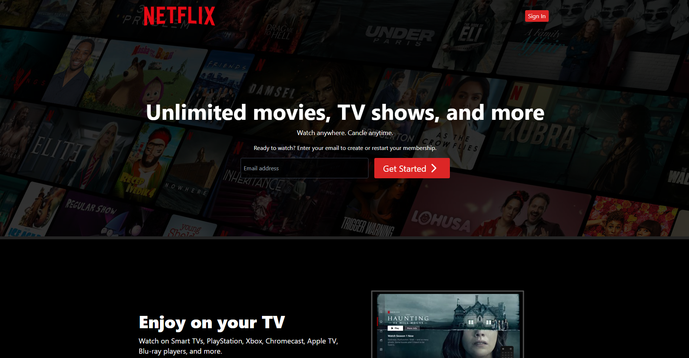

 
 

 

  Connect with Remi Olateru on <a href="https://www.linkedin.com/in/remi-olateru/">LinkedIn!</a>

## Project Overview

This project is a recreation of Netflix’s user interface, featuring MongoDB, Express.js, React, Node.js (MERN). It includes user authentication (Signup/Login), browse TV shows, Movies, Actors/Actresses through the search functionality, watch trailers, and view insights on video data.

## Features

- **User Authentication**
- **Browse Movies, TV Shows, Actors/Actresses**

- **Search Functionality**
- **Responsive Design**

### Hero Page

### Login Page

### Sign Up Page

### Home Page

### Search Shows / Movies

## Technologies Used

- **Frontend**: [React, Tailwind CSS]
- **Backend**: [Node.Js]
- **Database**: [MongoDB]

# Netflix Clone Implementation Overview

## Recap
This document covers:
- **Why I decided to build this project**
- **What I learned during the process**
- **The technical implementation of the Netflix Clone**

---

## Why I Decided to Build This Project

This project started with my passion for web development and learning how large-scale platforms like Netflix function. By working on this Netflix clone, I gained hands-on experience in designing and implementing features such as user authentication, search functionality, and dynamic content retrieval. I also explored how front-end and back-end systems work together seamlessly.

Additionally, I wanted to challenge myself to create a fully functional, modern application with user interaction and responsive design. This project was a perfect opportunity to deepen my knowledge of RESTful APIs, client-server communication, and responsive front-end design.

---

## What I Learned During the Process

I learned a tremendous amount while building this project:
- **Authentication Using JWT**: Implemented user login and signup features with secure token-based authentication.
- **Dynamic Content Management**: Integrated APIs to fetch trending movies, TV shows, and actor information dynamically.
- **Frontend and Backend Integration**: Connected a React-based frontend with an Express.js backend, enabling seamless communication between the two layers.
- **State Management**: Used React hooks like `useState` and `useEffect` to manage application state efficiently.
- **Error Handling**: Developed error handling mechanisms for both the backend API endpoints and the frontend UI.
- **Responsive UI**: Designed a mobile-friendly interface to ensure an optimal user experience across devices.

---

## The Technical Implementation of the Netflix Clone

### Backend Implementation
- **Technology Stack**: 
  - Built using Node.js, Express.js, and MongoDB.
  - Used Mongoose for database modeling and validation.
  - Integrated JWT for secure user authentication.

- **API Development**:
  - Created RESTful endpoints for:
    - User signup, login, and authentication checks.
    - Fetching trending content based on type (movies or TV shows).
    - Search functionality for movies, TV shows, or actors.
  - Included robust validation and error-handling logic.

- **Dynamic Routing**:
  - Supported different types of content via endpoints like `/api/v1/movies/trending` and `/api/v1/tv/trending`.
  - Incorporated query parameters for dynamic search functionality.

- **Error Management**:
  - Implemented centralized error handling for consistent responses across all API endpoints.

### Frontend Implementation
- **React Components**:
  - Built reusable React components for search bars, movie cards, and user profiles.
  - Implemented React hooks (`useState`, `useEffect`) for managing state and side effects.

- **Responsive Design**:
  - Used Tailwind CSS for a responsive, modern design.
  - Ensured smooth navigation across different pages (Home, Search, Login).

- **State Management**:
  - Used React's `useState` and custom hooks for managing application-wide state, such as the active user's details and the currently selected content type.

- **Frontend-Backend Communication**:
  - Integrated Axios for HTTP requests to interact with the backend.
  - Managed dynamic data fetching based on user actions (e.g., selecting movies vs. TV shows).

---

## Conclusion

This project was a challenging yet rewarding experience that enhanced my understanding of full-stack development. I learned how to design and build scalable APIs, and manage frontend-backend integration. The result is a fully functional Netflix clone with features such as user authentication, dynamic content retrieval, and responsive design. This project deepened my knowledge of web development and prepared me for tackling more complex systems in the future.

